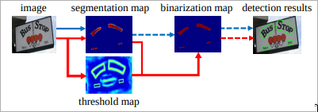

# Learn DBNet(Differentiable Binarization)

[Real-time Scene Text Detection with Differentiable Binarization](https://arxiv.org/abs/1911.08947)
[Real-Time Scene Text Detection with Differentiable Binarization and Adaptive Scale Fusion](https://arxiv.org/abs/2202.10304)

微分可能な2値化関数

## このリポジトリについて

画像や映像等からテキストを検出するための手法の1つである`DBNet`、及び`DBNet++`を学習のためのリポジトリ。

ソースコードのほとんどは[本家](https://github.com/MhLiao/DB)から模写して、一部動かない箇所は修正したり、自分が理解しやすいように修正している。

## DBNetとは

### 概要



下図の赤線が`DBNet`の文字検出フロー、青線がその他の主流な文字検出フロー。破線は推論時のみに必要なフローで、実践はトレーニング時と推論時の両方で必要なフロー。

大まかな流れとして下記のとおり。

- 特徴量の抽出: 入力画像から特徴量を抽出する。論文では`ResNet-18`を用いている。画像内の文書領域やオブジェクト領域などを特徴的に表現する特徴量を抽出する。
- 確率マップ(`probability map`)の作成: 特徴量を用いて、各ピクセルにおけるテキストの存在確率を計算する。
- しきい値マップ(`threshold map`)の作成: 特徴量を用いて、各ピクセルにおけるしきい値マップを作成する。
- 近似バイナリマップ(`approximate binary map`)の作成: 確率マップ(`probability map`)としきい値マップ(`threshold map`)を用いて、各ピクセルがテキスト領域に属するか否かを示す`0`と`1`の二値情報を格納したマップを作成する。


### 何がすごいのか？

原典によると、下記のような特徴を持つ。

- 優れた精度
- 優れたパフォーマンス(後処理を簡素化されたため)
- ResNet-18等の軽量なバックボーンであっても、検出精度が良い。サイズが大きなモデルの方が精度は高いが、小さいモデルであっても精度が落ちない
- 推論時はしきい値マップ(`threshold map`)のフローを取り除けるため、テストに追加のメモリや時間を消費しないで済む。

自分がポイントだと思ったのは2点。

- しきい値マップ(`threshold map`)を特徴量を使って計算する
- 近似バイナリマップ(`approximate binary map`)も計算する

一般的な方法では、しきい値は固定で予め用意する必要があるが、DBNetは特徴量から計算して出す。計算できるということは学習もできる。

近似バイナリマップ(`approximate binary map`)は、確率マップ(`probability map`)としきい値マップ(`threshold map`)を用いて計算する。確率マップ(`probability map`)を`p`、しきい値マップ(`threshold map`)を`t`とすると、下記の計算式となる。

$$
f(p - t) = \frac{1}{1 + e^{-k(p - t)}}
$$

論文の中で、`k`の値は`50`に設定されている。

この計算式は、シグモイド関数と同様、階段関数に近いグラフを描くので、この関数を使って2値化している。

$$
\sigma(x) = \frac{1}{1 + e^{-x}}
$$

他のモデルと比較して速いとか遅いとかは、その知見が自分にないので正直評価できない。

### 確率マップからのラベルの生成


確率マップのラベル生成は、PSENet (Wang et al. 2019a) にヒントを得たそうだ。

与えられたテキスト画像では、各テキスト領域のポリゴンが一連の線分で記述される。

$$
G = \{S_k\}_{k=1}^{n}
$$

$n$ は頂点数。異なるデータセットでは異なる頂点数があり、例えば ICDAR 2015 データセットでは 4 頂点、CTW1500 データセットでは 16 頂点となる。

次に、正のサンプル領域は Vatti クリッピング アルゴリズム (Vati 1992) を使用してポリゴン $G$ を収縮させて $G_s$ を生成することで作成される。

収縮のオフセット $D$ は、元のポリゴンの周囲長 $L$ と面積 $A$ を使って計算される。

$$
D = \frac{A(1 - r^2)}{L}
$$

$r$ は収縮比率で、経験的に 0.4 に設定される。

同様の手順で、しきい値マップのラベルを生成できる。まず、テキストポリゴン $G$ が $G_d$ と同じオフセット $D$ で拡大される。$G_s$ と $G_d$ の間のギャップをテキスト領域の境界と見なし、G 内の最も近いセグメントまでの距離を計算することでしきい値マップのラベルを生成できる。

### 損失関数

全体の損失関数は下記のとおり。

$$
L = L_s + \alpha \times L_b + \beta \times L_t
$$

確率マップ損失 $L_s$、二値マップ損失 $L_b$、しきい値マップ損失 $L_t$ 加重合計として表される。損失の数値に応じて、$\alpha$ と $\beta$ はそれぞれ 1.0 と 10 に設定される。

[本家](https://github.com/MhLiao/DB)では、このリポジトリのコメントにも書いているが下記のように計算しているように思えるが、自分のプログラム上の変数と関数の変数が一致してないからか？

$$
L = L_b + \alpha \times L_s + \beta \times L_t
$$

***

確率マップ損失 $L_s$、二値マップ損失 $L_b$は、バイナリ クロスエントロピー (BCE) 損失が適用される。

$$
L_s = L_b = \sum_{i \in S_l} \left[ y_i \log x_i + (1 - y_i) \log (1 - x_i) \right]
$$

$S_l$ はサンプリングされたセットで、正負サンプルの比率は 1:3。

***

閾値マップ損失 $L_t$ は、予測値とラベルの間の、拡張テキストポリゴン $G_d$ 内の $L_1$ 距離の総和。

$$
L_t = \sum_{i \in R_d} | y_i^* - x_i^* |
$$

$R_d$ は拡張テキストポリゴン $G_d$ 内のピクセルのインデックスのセット、$y_i^*$ は閾値マップのラベル。

***

推論段階では、効率を高めるために確率マップを使って境界ボックスを生成し、このことで閾値分岐を省略する。

境界ボックス生成のプロセスには 3 つのステップがある：

1. 確率マップまたは近似された二値マップを固定閾値 0.2 で二値化して二値マップを得る
2. 二値マップから連結成分（収縮されたテキスト領域）を抽出
3. Vatti クリッピング アルゴリズムを使用してこれらの収縮領域を拡張し、オフセット $D_0$ を次のように求める

    $$
    D_0 = \frac{A_0 \times r_0}{L_0}
    $$

$A_0$ は収縮ポリゴンの面積、$L_0$ は収縮ポリゴンの周囲長、$r_0$ は経験的に 1.5 に設定される。

## DBNet++

## Train

### 実行方法

```
$ hatch run python train.py --dataset icdar2015 --epochs 100 --batch-size=6
```

### Datasetsの準備

#### ICDAR 2015

`datasets/icdar2015`に配置して展開

- [train image](https://rrc.cvc.uab.es/?com=downloads&action=download&ch=4&f=aHR0cHM6Ly9ycmMuY3ZjLnVhYi5lcy8/Y29tPWRvd25sb2FkcyZhY3Rpb249ZG93bmxvYWQmZmlsZT1jaDRfdHJhaW5pbmdfaW1hZ2VzLnppcA==)
- [train gt](https://rrc.cvc.uab.es/?com=downloads&action=download&ch=4&f=aHR0cHM6Ly9ycmMuY3ZjLnVhYi5lcy8/Y29tPWRvd25sb2FkcyZhY3Rpb249ZG93bmxvYWQmZmlsZT1jaDRfdHJhaW5pbmdfbG9jYWxpemF0aW9uX3RyYW5zY3JpcHRpb25fZ3Quemlw)
- [test image](https://rrc.cvc.uab.es/?com=downloads&action=download&ch=4&f=aHR0cHM6Ly9ycmMuY3ZjLnVhYi5lcy8/Y29tPWRvd25sb2FkcyZhY3Rpb249ZG93bmxvYWQmZmlsZT1jaDRfdGVzdF9pbWFnZXMuemlw)
- [test gt](https://rrc.cvc.uab.es/?com=downloads&action=download&ch=4&f=aHR0cHM6Ly9ycmMuY3ZjLnVhYi5lcy9kb3dubG9hZHMvQ2hhbGxlbmdlNF9UZXN0X1Rhc2sxX0dULnppcA==)

## Test

## Predict
